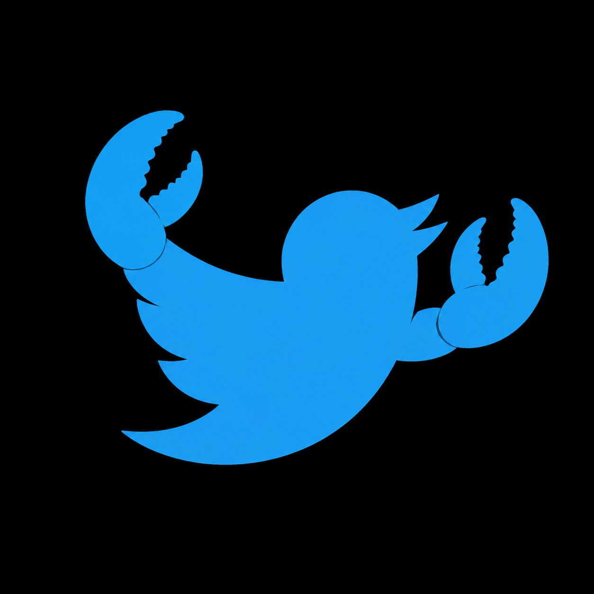

<div align="center">
  

  # birdclaw

  **Your bird. Your claws.** A small, self-hosted Twitter-style microblog.

  No framework, no build step, no nonsense. One `node server.js` and you're tweeting at yourself.
</div>

---

## What it is

A complete, working microblog in a single repo:

- **Timeline** with "For you" and "Following" tabs
- **Posts, replies, threads** (real parent/child relationships)
- **Likes, reposts, follows** with optimistic UI
- **Profiles** with banner, bio, follower counts, and Posts/Replies/Likes tabs
- **Search** across posts and users
- **Trending hashtags** computed from real post content
- **Multi-account switching** for local testing
- **Twitter-blue dark theme** that doesn't look AI-generated

## Stack

- **Backend:** Node.js + Express
- **Database:** SQLite via [sql.js](https://github.com/sql-js/sql-js) — pure JavaScript, no native build dependencies
- **Frontend:** Hand-rolled HTML + CSS + ES modules. No React, no Vue, no bundler.

The whole thing is ~50KB of source code.

## Run it

```bash
git clone https://github.com/ClawGrabSOL/birdclaw.git
cd birdclaw
npm install
npm start
```

Open <http://localhost:4178>.

The database (`birdclaw.db`) is created and seeded on first boot with 12 users and 30 posts so the app isn't empty.

## Project layout

```
birdclaw/
├── server.js              # Express app + routes
├── db.js                  # better-sqlite3-compatible shim over sql.js
├── scripts/seed.js        # Seed data (users, posts, follows)
├── public/
│   ├── index.html
│   ├── styles.css         # All design tokens + components
│   ├── app.js             # SPA router + views
│   └── assets/birdclaw-logo.jpg
└── package.json
```

## API

All endpoints return JSON. Authentication is a `bc_uid` cookie that points at a user id — switch accounts with the in-UI account switcher.

| Method | Path | Notes |
| ------ | ---- | ----- |
| `GET`  | `/api/me` | Current user + follower/following counts |
| `GET`  | `/api/users` | All users |
| `POST` | `/api/switch-user` | Body: `{ id }`. Sets `bc_uid` cookie. |
| `GET`  | `/api/feed?tab=foryou\|following` | Top-level posts |
| `GET`  | `/api/posts/:id` | Post + ancestors + replies |
| `POST` | `/api/posts` | Body: `{ body, parent_id? }` |
| `DELETE` | `/api/posts/:id` | Only your own |
| `POST` | `/api/posts/:id/like` | Toggle |
| `POST` | `/api/posts/:id/repost` | Toggle |
| `GET`  | `/api/users/:handle` | Profile + posts/replies/likes |
| `POST` | `/api/users/:handle/follow` | Toggle |
| `GET`  | `/api/suggestions` | Who to follow |
| `GET`  | `/api/search?q=` | Posts + users |
| `GET`  | `/api/trends` | Top hashtags from the last 14 days |

## Configuration

| Env | Default | Notes |
| --- | ------- | ----- |
| `PORT` | `4178` | HTTP port |

## Why does this exist?

Because every "build a Twitter clone" tutorial stops at a feed and a like button. This one ships profiles, threads, trends, follows, search, and a design that doesn't look like a Tailwind template.

## License

MIT — see [LICENSE](LICENSE).

> Not affiliated with X Corp, Twitter, or [birdclaw.sh](https://birdclaw.sh) (a separate local-first Twitter archive project by Peter Steinberger).
